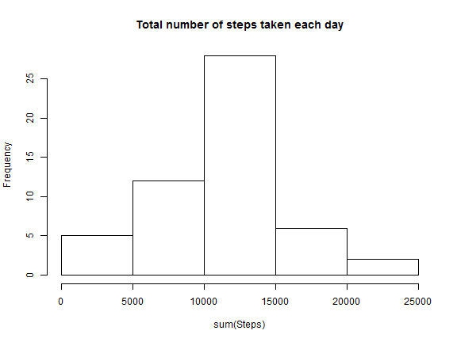
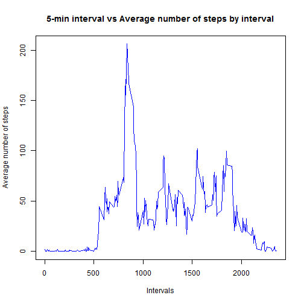
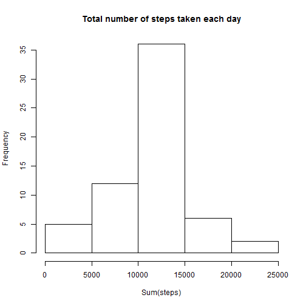
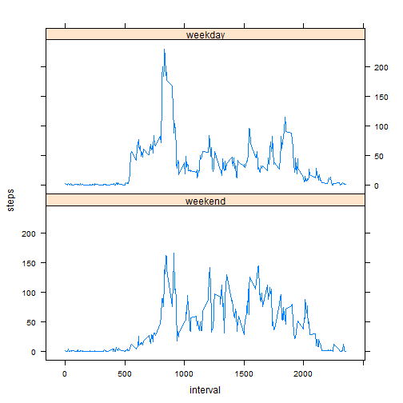

## Loading and preprocessing the data
### 1. Unzip the file

```r
unzip('./activity.zip', exdir = '.')
```

### 2. Load the unzipped file

```r
data <- read.csv('./activity.csv', na.strings = 'NA', stringsAsFactors = FALSE)
```

### 3. Data format conversion

```r
data$date <- as.Date(data$date, '%Y-%m-%d')
```

## What is mean total number of steps taken per day?

### 1. Histogram of the total number of steps taken each day
Calculate the sum of the steps per day as follows (consider NAs as 0):


```r
sumPerDay <- aggregate(data$steps ~ data$date,FUN = sum)
colnames(sumPerDay)[2] <- 'sum'
```


```r
hist(sumPerDay$sum, main = 'Total number of steps taken each day', xlab = 'sum(Steps)')
```

 

### 2. Mean and median total number of steps taken per day


```r
meanOfSums <- mean(sumPerDay$sum)
meanOfSums
```

```
## [1] 10766.19
```


```r
medianOfSums <- median(sumPerDay$sum)
medianOfSums
```

```
## [1] 10765
```

## What is the average daily activity pattern?

### 1. Time series plot of the 5-minute interval and the average number of steps taken, averaged across all days


```r
meanPerInterval <- aggregate(data$steps ~ data$interval, FUN = mean)
plot(meanPerInterval, type = 'l', main = '5-min interval vs Average number of steps by interval', xlab = 'Intervals', ylab = 'Average number of steps', col = 'blue')
```

 

### 2. Interval, on average across all the days in the dataset, which contains the maximum number of steps


```r
names(meanPerInterval) <- c('interval', 'steps')
sortedMeanPerInterval <- meanPerInterval[order(meanPerInterval$steps, decreasing = 'TRUE'),]
intervalMaxSteps <- sortedMeanPerInterval[1, 1]
intervalMaxSteps
```

```
## [1] 835
```

Interval 835, on average across all the days in the dataset, contains the maximum number of steps.

## Imputing missing values

### 1. Calculate and report the total number of missing values in the dataset (i.e. the total number of rows with NAs)


```r
missingSteps <- sum(is.na(data$steps))
```

### 2. Devise a strategy for filling in all of the missing values in the dataset.
Fill in with average, across other dates, for that interval

### 3. Create a new dataset that is equal to the original dataset but with the missing data filled in.


```r
dataNoNA <- data
dataNoNA$steps <- mapply(function(x, y) {
    if(is.na(x)) {
        meanPerInterval$steps[match(y, meanPerInterval$interval)]
    } else {
        x
    }
}, data$steps, data$interval)
```

### 4.1 Make a histogram of the total number of steps taken each day and Calculate and report the mean and median total number of steps taken per day.


```r
sumPerDayNoNA <- aggregate(dataNoNA$steps ~ dataNoNA$date, FUN = sum)
colnames(sumPerDayNoNA)[2] <- 'sum'
hist(sumPerDayNoNA$sum, main = 'Total number of steps taken each day', xlab = 'Sum(steps)')
```

 

### 4.2 Do these values differ from the estimates from the first part of the assignment?
Based on this strategy, there is not much change to the distribution because the NA's were filled with averaged values.

### 4.3 What is the impact of inputing missing data on the estimates of the total daily number of steps?
Impact of inputing missing data is minimal in this case. Non-valid records have been removed even though they have been estimated.

## Are there differences in activity patterns between weekdays and weekends?

### 1. Create a new factor variable in the dataset with two levels - "weekday" and "weekend" indicating whether a given date is a weekday or weekend day.


```r
col <- c('Sunday', 'Monday', 'Tuesday', 'Wednesday', 'Thursday', 
  'Friday', 'Saturday')[as.POSIXlt(dataNoNA$date)$wday + 1]
tempData <- cbind(dataNoNA, col)
colnames(tempData)[4] <- 'weekday'

daytype <- as.factor(tempData$weekday %in% c('Sunday', 'Saturday'))
levels(daytype) <- list(weekend = TRUE, weekday = FALSE)

dataNoNA <- cbind(dataNoNA, daytype)
```

### 2. Make a panel plot containing a time series plot (i.e. type = "l") of the 5-minute interval (x-axis) and the average number of steps taken, averaged across all weekday days or weekend days (y-axis). 


```r
meanPerIntervalDateType <- aggregate(dataNoNA$steps ~ dataNoNA$interval * dataNoNA$daytype, FUN = mean)
colnames(meanPerIntervalDateType) <- c('interval', 'daytype', 'steps')
library(lattice)
xyplot(steps ~ interval|daytype, data = meanPerIntervalDateType, layout = c(1, 2), type = 'l')
```

 
